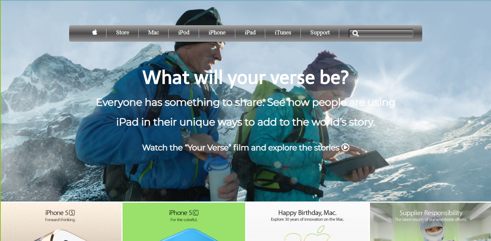

<h1>#Building with Backgrounds and Gradients</h1>

This project is a clone of Apple website interface. The aim of this project was to recreate Apple design using html,css and css positioning technologies.

</h1>Additional description about the project and its features.</h1>

<h2>Built With</h2>

Html

CSS

Atom editor, Visual code

<h2>Live Demo</h2>
https://raw.githack.com/khalilhamdii/Building_with_Backgrounds_and_Gradients/feature-branch/index.html

<h2>Getting Started</h2>
To get a local copy up and running follow these simple example steps.

Prerequisites
Text editor,Github profile and Git.

<h2>Authors</h2>

👤 Author1

- Github: [@ajkacca457](https://github.com/ajkacca457)

- Twitter: [@ajkacca](https://twiter.com/ajkacca)

- Linkedin: [LinkedIn](https://www.linkedin.com/in/avijit-karmaker-8738a54a/)

👤 Author2

- Github: [@khalilhamdii](https://github.com/khalilhamdii)

- LinkedIn: [LinkedIn](https://www.linkedin.com/in/khalilhamdi/)

🤝 <h2>Contributing</h2>

Contributions, issues and feature requests are welcome!

Feel free to check the issues page.

Show your support
Give a ⭐️ if you like this project!

📝 <h2>License</h2>
This project is a collaboration project of microverse students. All rights are reserved for Avijit and Khalil.
